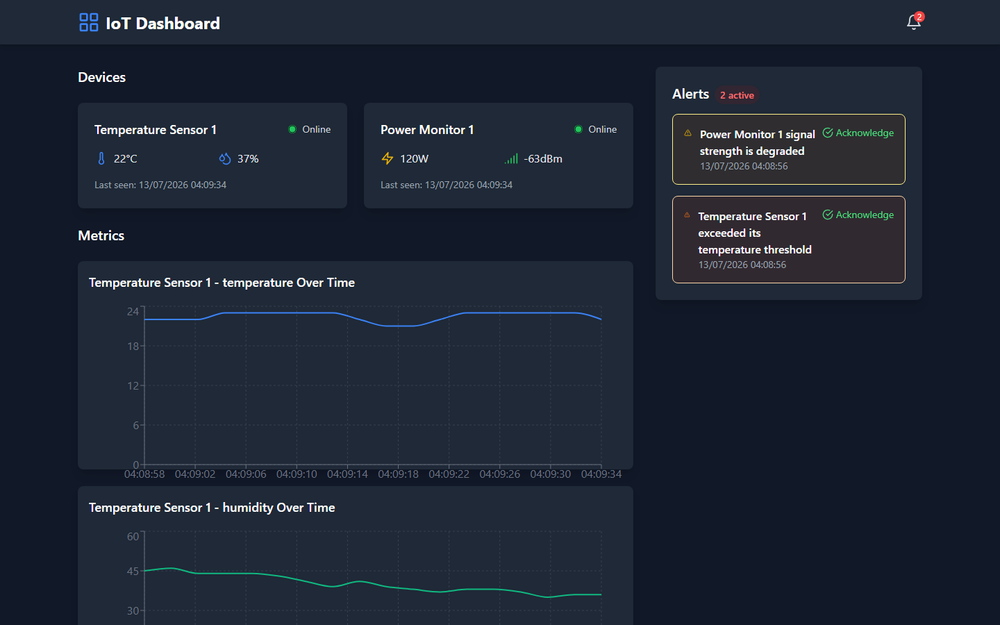
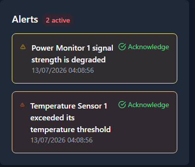
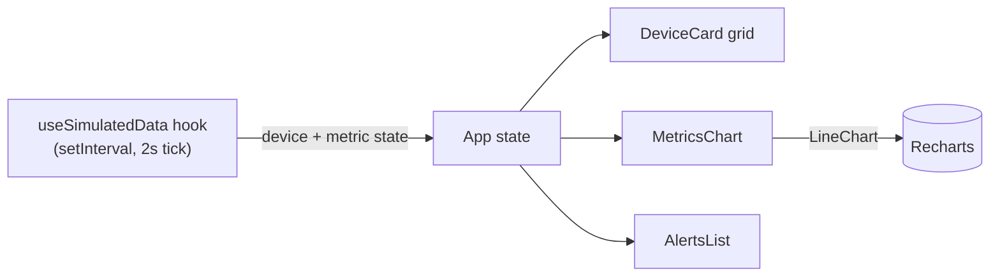

# IoT Simulation and Monitoring System

> A front-end IoT monitoring dashboard built with React, TypeScript and Vite, driven by a self-contained simulated data layer.

[](https://github.com/Younes-Alaoui-Ismaili/IoT-Simulation-and-Monitoring-System/actions/workflows/ci.yml)


A single-page dashboard that visualizes live device telemetry (temperature, humidity, power, signal) in real-time line charts. Instead of a backend, it ships a **simulated data layer**: a React hook generates and mutates device metrics on a fixed tick, which keeps the project fully self-contained and runnable with a single command, and makes it an easy base to later swap for a real data source (WebSocket, REST, or a message stream).

## Screenshots





## Features

- **Real-time telemetry**: device metrics update on a 2-second tick and stream into the UI.
- **Live charts**: time-series line charts (Recharts) with a rolling history window per metric.
- **Device status cards**: per-device status, latest readings, and last-seen timestamp, with icon-based readouts (lucide-react).
- **Alerts panel**: seeded demo alerts you can acknowledge; each acknowledgement clears the alert and is recorded to an audit trail in the data hook.
- **Dark mode ready**: Tailwind `dark:` styling throughout.
- **Fully typed domain model**: device, alert, metric and audit types defined as TypeScript interfaces.

## Architecture

The application is entirely client-side. A single hook owns the simulated state and pushes updates into the component tree, which renders it through Recharts.



- `src/hooks/useSimulatedData.ts`: owns all state, generates metric updates on an interval and models bounded random walks per metric.
- `src/components/Dashboard/`: presentational components (device cards, charts, and alerts).
- `src/types/index.ts`: the shared domain model.

## Tech stack

- **Framework**: React 18 + TypeScript
- **Build tool**: Vite 5
- **Styling**: Tailwind CSS 3
- **Charts**: Recharts
- **Icons**: lucide-react

## Getting started

Requirements: Node.js 18+ and npm.

```bash
# install exact dependencies
npm ci

# start the dev server
npm run dev

# production build
npm run build

# preview the production build
npm run preview
```

Then open the URL printed by Vite (default `http://localhost:5173`).

## Roadmap

This is a prototype kept as a technical showcase. Candidate next steps, in rough order:

- Replace the simulated data layer with a real data source (WebSocket or REST).
- Add a test suite and continuous integration.
- Persist and configure devices instead of seeding them in code.

## License

Released under the [MIT License](LICENSE).
