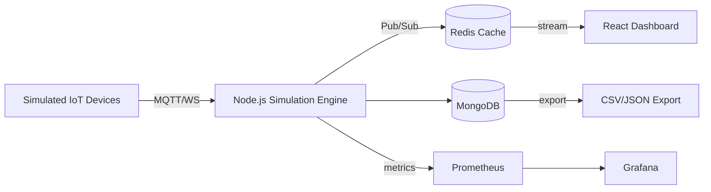

# IoT Simulation and Monitoring System

> Banc de simulation IoT temps réel (Node.js + Redis + MongoDB, 10k msg/s).

---

## Pourquoi ce repo

Ce projet est un banc d'essai construit pour valider des patterns d'architecture IoT temps réel avant de les transposer dans le stack Aura, mon compagnon vocal IA edge-first pour personnes isolées (Solutions Robaian, Montréal).

**Statut** : prototype, non maintenu depuis janvier 2025. Conservé en vitrine comme preuve de capacité technique sur les pipelines IoT temps réel.

**Pertinence Aura** : les patterns d'observabilité (Prometheus, Grafana), de stockage hybride (MongoDB pour métadonnées + Redis pour streaming), et le découpage modulaire ont été directement réutilisés dans la pipeline d'observabilité Aura (radar FMCW + métriques edge + dashboard aidant).

---

## Ce que démontre ce projet

- Architecture événementielle multi-composants (Redis Pub/Sub + WebSocket).
- Stockage hybride (Redis cache temps réel + MongoDB persistant).
- Modélisation de pannes et de patterns de données pour tests réalistes.
- Observabilité production-grade (Prometheus + Grafana).
- API REST + WebSocket pour gestion du cycle de vie des devices.
- Containerisation Docker complète.

## Architecture

## Stack

- **Backend** : Node.js (v16+), Express, WebSocket.
- **Stockage** : Redis (Pub/Sub + cache), MongoDB (metadata + historique).
- **Frontend** : React + Vite + Tailwind CSS + TypeScript.
- **Observabilité** : Prometheus + Grafana.
- **Déploiement** : Docker Compose.

## Démarrer

Voir l'ancien README à la racine (`README.old.md`) pour les instructions détaillées d'installation et de démarrage local.

---

## A propos

Younes Alaoui Ismaili, fondateur de Solutions Robaian inc.
Site web (à venir) : [robaian.com](https://robaian.com)
Contact : info@robaian.com

## Licence

MIT.
